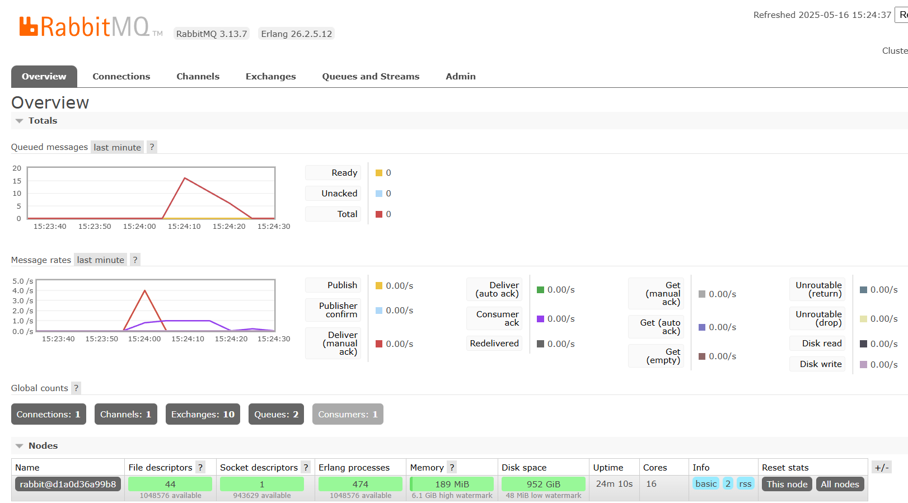

# skibidi-adpro-5.1

## What is amqp?
AMQP (Advanced Message Queuing Protocol) is a standard messaging protocol used to enable reliable, asynchronous communication between different components of a system. It allows one component (the producer) to send messages to a broker, which then stores the messages in queues until another component (the consumer) retrieves them. This decouples the sender and receiver, making the system more flexible and fault-tolerant. AMQP supports various messaging patterns such as point-to-point and publish-subscribe, making it suitable for distributed systems and microservices architectures. RabbitMQ is a commonly used message broker that implements the AMQP protocol.

## What does it mean? guest:guest@localhost:5672 , what is the first guest, and what is the second guest, and what is localhost:5672 is for?
The string guest:guest@localhost:5672 is a common way to represent a connection to an AMQP broker like RabbitMQ, and it follows thes general format `username:password@host:port`. First guest is the username used to log in to the RabbitMQ broker. Second guest is the password for the user (in this case, the same as the username). localhost is the host where the RabbitMQ server is running. localhost means it’s running on the same machine as the client connecting to it. 5672 is the port number that RabbitMQ uses for AMQP connections (by default, it's 5672 for non-TLS connections). So, `guest:guest@localhost:5672` means: Connect to RabbitMQ on the local machine at port 5672 using the username "guest" and password "guest".

## Screenshot
- The smaller number of queues on my machine specifically, a total of 16 indicates that the system is handling message flow more efficiently, or that fewer queues are being created by the application. In contrast, a higher queue count on other machines can occur when the publisher sends messages at a faster rate than the subscriber can process them. When the subscriber is slower, unprocessed messages begin to accumulate, and depending on how the system or code is set up, additional queues may be created to handle the overflow or categorize messages. In my case, the subscriber is keeping up more closely with the publisher, which reduces message buildup and keeps the number of queues low.
